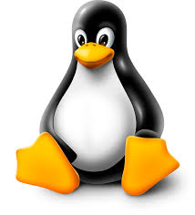

# LINUX 

## what is os? 
* **_Operating system is an interface between user and the computer hardware._**

* The hardware of the computer cannot understand the human readable language as it works on binaries i.e. 0's and 1's. 

* Also it is very tough for humans to understand the binary language, in such case we need an interface

* Which can translates human language to hardware and vice-versa for effective communication.

[link](https://www.guru99.com/operating-system-tutorial.html "use this link for")

## Types of Operating System:

* Single User - Single Tasking Operating System
* Single User - Multitasking Operating System
* Multi User - Multitasking Operating System

