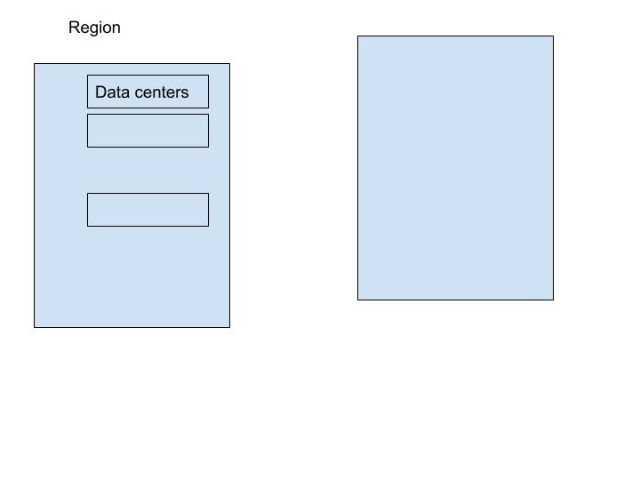

# Linux
## Linux basic commands
```
* mkdir myfolder
* mkdir -p maha/{1/{a,b},2/{a,b}}
* tree 
* touch
* vi
* nano
* cat
* '>>'
* cp <source file> < destination directory>
*  cp -rvfp <dir name> <destination directory name>
*  mv <filename> <destination directory name> : cut & paste
*  mv <old filename> <new filename> : rename file
* mv <old dir name> <new dir name> : rename dir
*  cmp file1 file2
*  diff  file1 file2
*  rm  filename
*  rm -f filename          without prompting
*  rmdir <directory name>
*  rm -rf <directory name>
*  hostname  : get host name
*  uname     : type machine
*  uname -a  :  version , proces
*  top
* date
* ps
*  ps -ef
*  who  | wc -l  :  how many users  logged
*  whoami        : who logged in
* netstat -a
*  netstat -an |grep 20001
* netstat -an |grep 178

```


